## Choix modèle

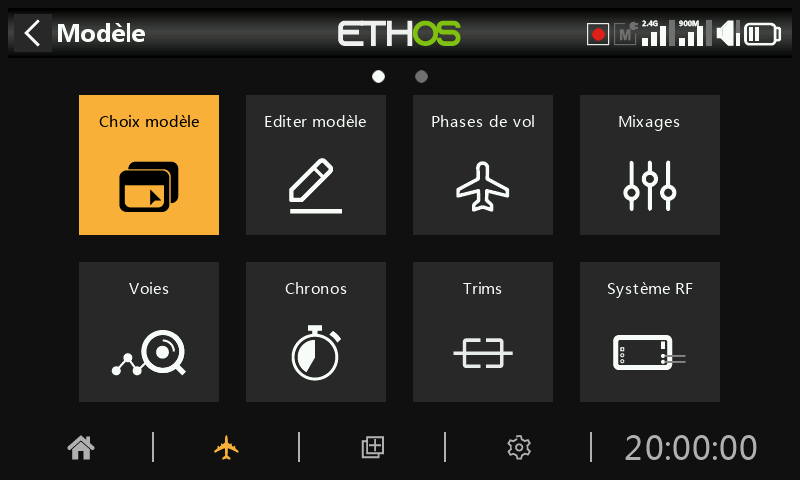

La sélection d'un modèle est accessible en sélectionnant « Choix modèle » dans le menu Modèle.

Il permet de sélectionner le modèle courant, d'ajouter un nouveau modèle, de le dupliquer tout ou partie, d’envoyer ou de recevoir un modèle via Bluetooth, ou de le supprimer.

### Gestion des dossiers de modèles

Ethos vous permet de créer vos propres dossiers afin de classer et regrouper vos modèles.

Des noms de dossiers typiques peuvent être : Avions, Planeurs, Hélicos, Quads, Warbirds, Bateaux, Voitures, Modèles, Archive, etc.

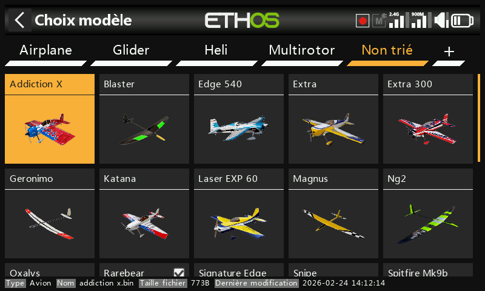

Tant que vous n’avez pas créé et organisé vos dossiers, Ethos créera automatiquement le dossier « Non trié ».

Cela se produit lorsque vous mettez à jour vers Ethos version 1.1.0 alpha 17 ou ultérieure, ou lorsque vous copiez un modèle provenant d’Internet ou d’un ami dans le dossier **models** sur la carte SD ou eMMC.

Ethos supprimera automatiquement le dossier **« Non trié »** lorsqu’il ne sera plus nécessaire.

Pour créer votre premier dossier, appuyez sur le **« + »** à droite de l’étiquette **« Non trié »**, ou effectuez un appui long sur la touche **Page Up/Down**.

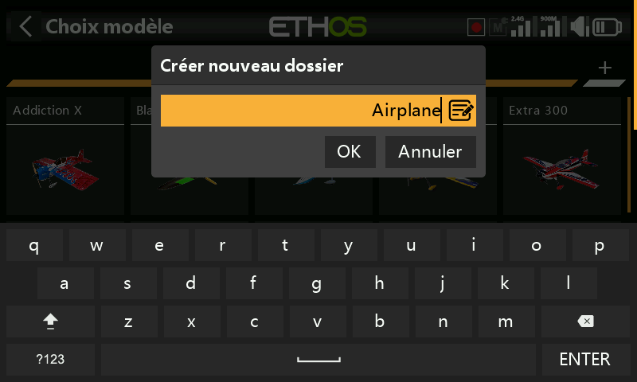

Saisissez le nom dans la boîte de dialogue **« Créer nouveau dossier »**, puis appuyez sur **OK**.

Les noms peuvent comporter jusqu'à **15 caractères**. Répétez l'opération si besoin pour vos autres dossiers.

Notez que ces dossiers apparaissent comme sous-dossiers du dossier **models** sur la carte SD ou la mémoire eMMC, selon la radio.

Les dossiers sont triés **par ordre alphabétique**, hormis le dossier **« Non trié »**, qui apparaîtra toujours en dernier dans la liste.

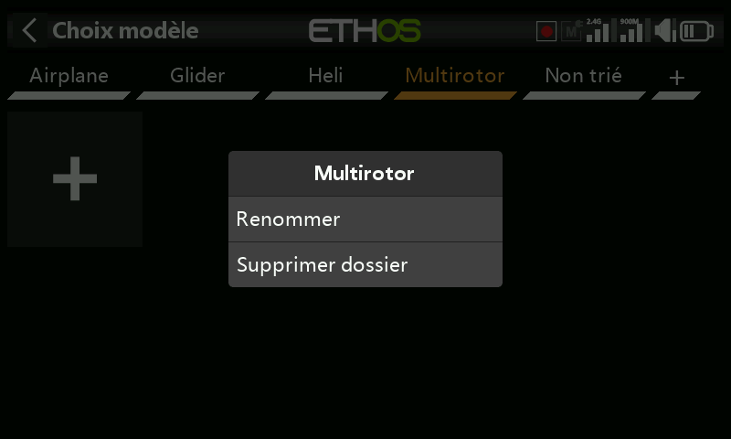

Un appui sur le nom de dossier fait apparaitre une boite de dialogue permettant de renommer ou de supprimer un dossier. Si des modèles se trouvaient dans le dossier supprimé, Ethos les déplace automatiquement dans le dossier "Non trié".

### Ajout d'un nouveau modèle

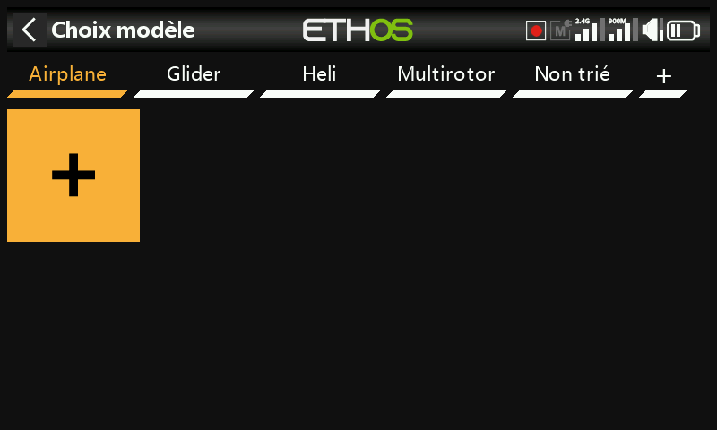

Pour créer un nouveau modèle, sélectionnez la catégorie de modèle sous laquelle vous souhaitez créer le modèle, puis appuyez sur l'icône **[+]** pour créer un nouveau modèle ou pour recevoir un modèle d'une autre radio Ethos via Bluetooth.

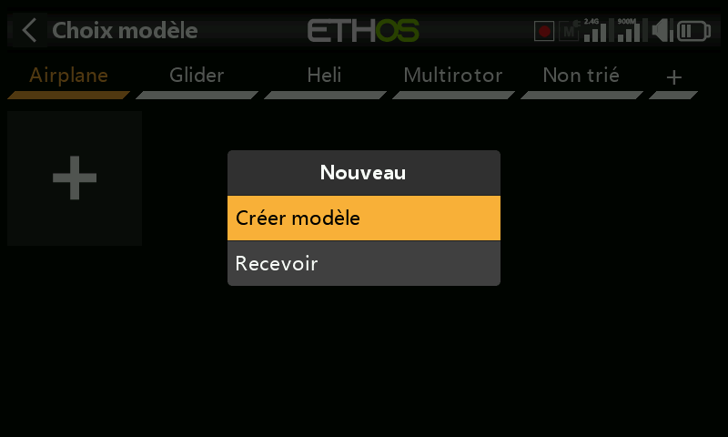

Appuyez sur **« Créer modèle »** pour lancer l'assistant de création de modèle (vous devrez peut-être d'abord créer vos catégories de modèles, voir ci-dessus).

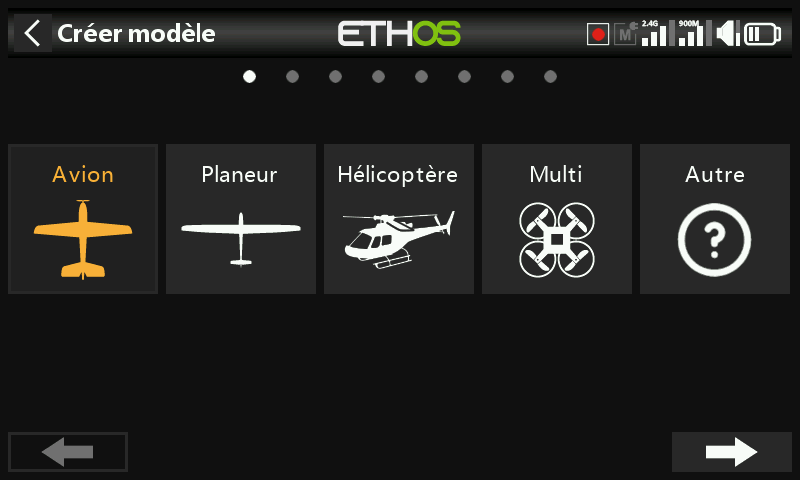

Choisissez le type de modèle que vous souhaitez créer et suivez les instructions.

Il existe des assistants pour :

* Avion
* Planeur
* Hélicoptère
* Multirotor
* Autre

Les assistants vous guident dans la configuration de base pour un type de modèle donné.

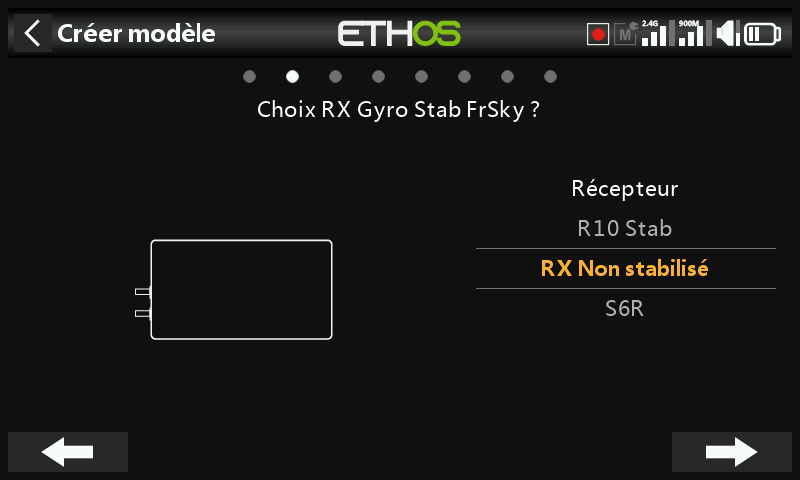

Les assistants incluent la configuration optionnelle de mixages prédéfinis pour les **récepteurs stabilisés FrSky**, tels que le gain et le mode de stabilisation.

Les récepteurs stabilisés FrSky nécessitent un ordre de canaux spécifique, à savoir **AETR**.

Par conséquent, l’option « Ordre des canaux » dans le menu Manches (Sticks) doit être laissée sur le réglage par défaut **AETR**, et l’option **« Quatre premiers canaux fixes »** doit être activée (ON), afin de garantir que l’ordre des canaux créé par l’assistant sera compatible avec le récepteur.

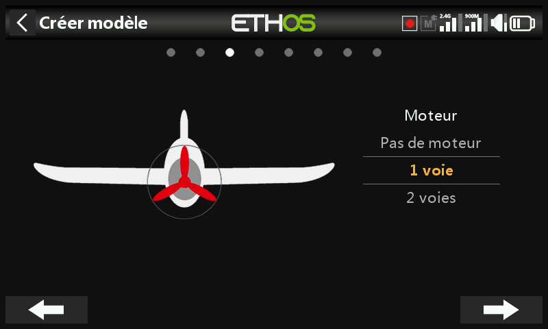

Pour un modèle de type avion, la page suivante est **« Moteur »**, qui permet de sélectionner le nombre souhaité de voies moteur (s’il y en a).

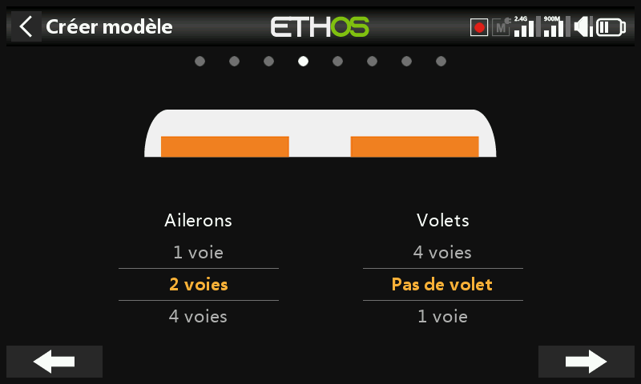

Pour un modèle de type avion, le nombre de voies d’ailerons et de volets (flaps) peut ensuite être choisi.

À partir d’Ethos 1.7.0, les assistants de création de modèle attribuent les voies en commençant par la gauche et en alternant de l’extérieur vers l’intérieur, afin d’être cohérents avec la documentation des récepteurs FrSky.

Ainsi, pour un modèle simple avec 2 ailerons, 1 profondeur, 1 direction et 1 moteur, l’ordre des voies sera le suivant (en supposant l’ordre de canaux par défaut AETR et l’option « Quatre premiers canaux fixes » activée) :

* CH1 Aileron gauche
* CH2 Profondeur
* CH3 Gaz
* CH4 Directio
* CH5 Aileron droit

### Mise à jour des modèles vers Ethos 26.1

Lors de la mise à jour vers Ethos 26.1, les modèles existants peuvent être convertis pour s’adapter au nouveau schéma de comptage des voies à partir de la gauche.

Il existe 3 scénarios :

#### Modèles existants avec l’ordre de voies par défaut 1.6.x (comptage depuis la droite)

Leurs mixages seront réarrangés pour correspondre au nouveau schéma (comptage depuis la gauche). Mais l’allocation des voies de sortie reste identique, donc aucun changement de câblage n’est nécessaire.

Seuls les mixages sont réordonnés dans la nouvelle séquence, mais les voies de sortie originales sont conservées pour que le modèle continue à fonctionner correctement.

Exemple de réorganisation des mixes :

**Avant :**

* CH1 Aileron droit

* CH2 Profondeur

* CH3 Gaz

* CH4 Direction

* CH5 Aileron gauche

**Après :**

* CH5 Aileron gauche

* CH2 Profondeur

* CH3 Gaz

* CH4 Direction

* CH1 Aileron droit

#### Modèles existants déjà configurés pour compter depuis la gauche

Ces modèles ne seront pas modifiés, car ils sont déjà conformes au nouveau schéma.

#### Modèles dont les voies ont été inversées manuellement (Aileron inversé et renommage des sorties)

Ces modèles fonctionneront correctement après la mise à jour, mais un conflit peut apparaître dans le nommage des voies.

Pour résoudre ce problème, il faut annuler les inversions de mixages précédemment appliquées :

* Ré-inverser le mix d’Aileron avec des valeurs positives pour le poids et le différentiel.

* Échanger les voies de sortie de l’aileron à l’aide de la fonction « Swap » dans le menu Canaux.

* Renommer également les deux voies pour correspondre correctement aux fonctions gauche et droite.

⚠️ Attention ! Après ces modifications, vérifiez que les mixages et les sorties fonctionnent correctement dans le bon ordre, sans les hélices.

Pour un examen détaillé des trois scénarios de conversion, veuillez vous référer à l’Annexe A – Conversion des modèles Ethos de 1.6.X à 26.1.

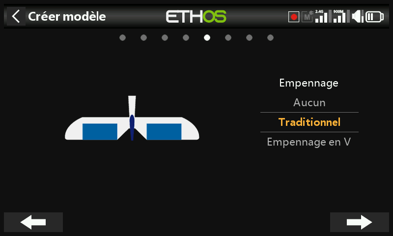

Pour un modèle de type avion, la configuration de l'empennage peut être soit **« Empennage traditionnel »** (en croix), soit **« Empennage en V »**, ou **« Aucun »** (pas d'empennage, par exemple pour un delta ou un aile volante).

### Ailes delta

Un mixage **Elevon** peut être obtenu en créant un nouveau modèle avion avec 2 ailerons et pas d'empennage, ce qui entraînera la création automatique du mixage Elevon.

Les poids par défaut des mixages sont de **50 % chacun**, afin d’obtenir un **total de 100 %** si ailerons et profondeur sont appliqués simultanément.

Alternativement, lors de l’utilisation d’un récepteur stabilisé, le mixage delta peut être effectué directement par le récepteur.

Dans l’assistant, pour cette situation, vous devez sélectionner 1 aileron et 1 profondeur, car le mixage Elevon sera effectué dans le récepteur.

Veuillez vous référer au manuel du récepteur stabilisé pour plus de détails.

Pour un modèle à aile delta possédant à la fois des surfaces d’ailerons et de profondeur, laissez l’assistant compléter le modèle comme si une queue était présente.
Il configurera les voies nécessaires pour les ailerons et la profondeur, avec ou sans gouvernail selon les besoins.

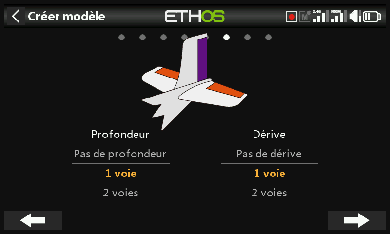

Pour un modèle de type avion, après avoir choisi par exemple un empennage traditionnel en croix, il est possible de configurer le nombre de voies pour la profondeur et la dérive.

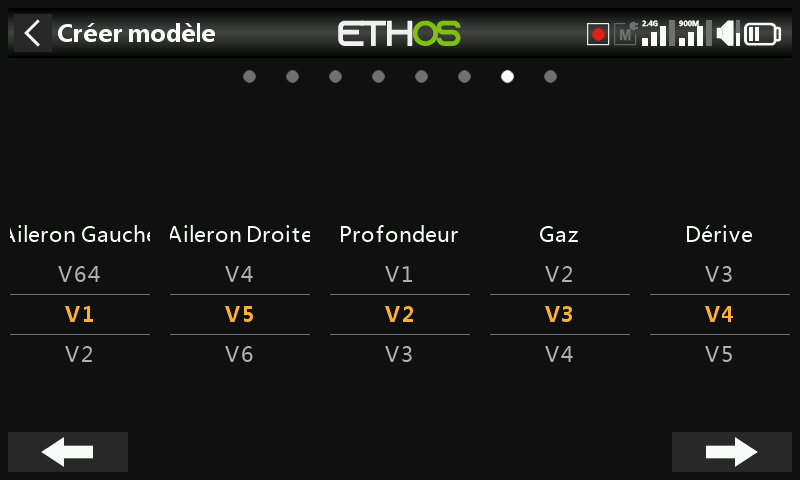

L’étape suivante permet de réaffecter les fonctions du modèle aux différentes voies.

L’assistant respecte l’ordre des voies défini dans le menu Manches (Sticks), mais cet écran permet de réaffecter les voies tout en gardant à l’esprit que les récepteurs stabilisés FrSky exigent que les voies stabilisées soient dans un ordre spécifique.

Veuillez vous référer au manuel du récepteur pour plus de détails.

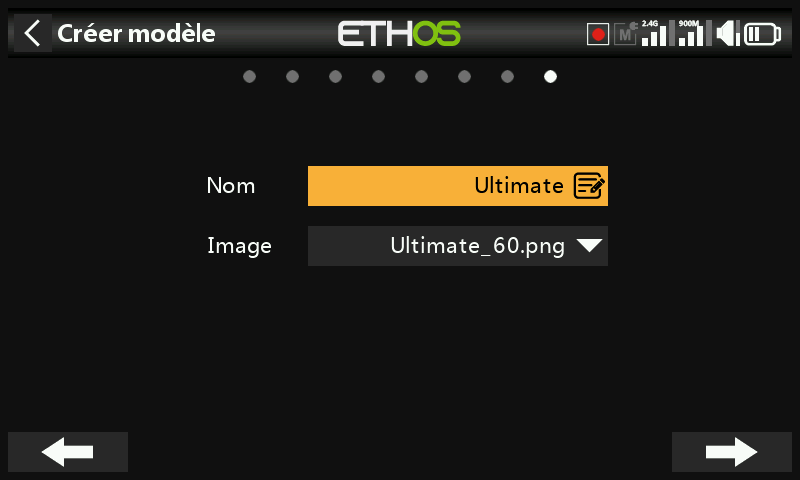

À la dernière étape, il est possible de définir le nom du modèle et de lier une image au modèle.
Notez que les noms de modèles peuvent comporter jusqu’à **15 caractères**.

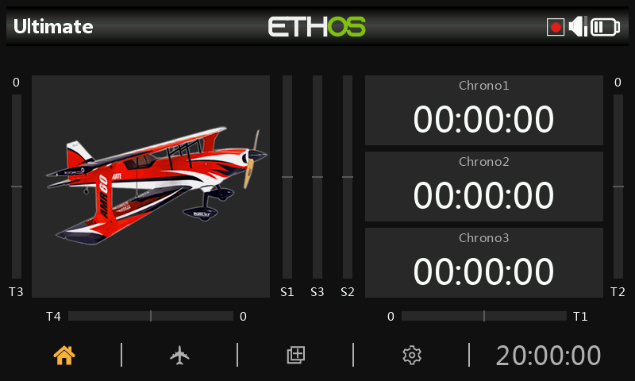

Le nouveau modèle a été créé.

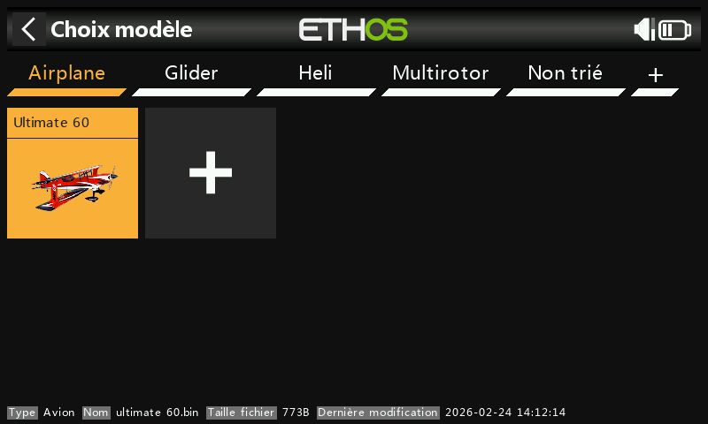

Le modèle créé apparaîtra dans le dossier de catégorie de modèle défini par l'utilisateur qui était actif au démarrage de l'assistant et sera rangé par ordre alphabétique.

Veuillez également vous référer à l’exemple d’avion à voilure fixe de base dans la section Tutoriels de programmation pour un exemple complet.

### Sélection de modèle

Appuyez sur « Choix modèle » pour afficher la liste de vos modèles.

Veuillez noter qu’après une mise à jour d’Ethos, les modèles sont convertis individuellement lorsqu’ils sont sélectionnés depuis l’écran de sélection de modèles.

Il n’est pas nécessaire de sélectionner chaque modèle immédiatement après la mise à jour, car **la conversion peut avoir lieu plus tard**, lorsqu’ils seront sélectionnés, même avec une version ultérieure d’Ethos.

Aucun délai perceptible n’est constaté lors de la conversion du modèle sélectionné.

Lorsque la conversion a lieu, la date de dernière modification affichée en bas de l’écran de sélection de modèles sera **mise à jour à la date actuelle**. Si aucune conversion n’est nécessaire, la date ne change que si vous apportez une modification au modèle.

#### Sélection rapide

Un **appui long tactile ou un appui long sur Entrée** sur l’icône d’un modèle permettra de passer immédiatement à ce modèle.

Voir également la section « Choisir le modèle courant » ci-dessous.

### Menu de gestion des modèles

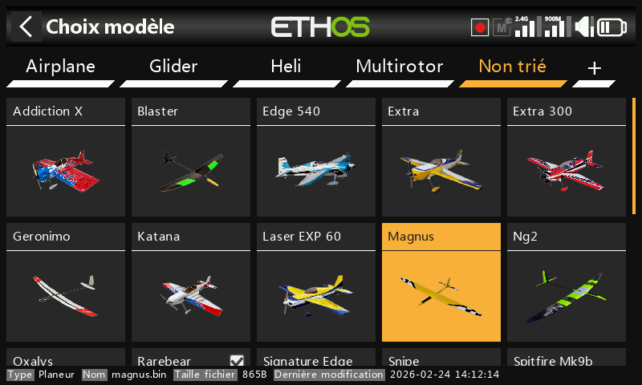

Appuyez sur un **modèle** pour le **sélectionner**, puis appuyez de nouveau dessus pour **ouvrir le menu de gestion du modèle**.

#### Choisir le modèle courant

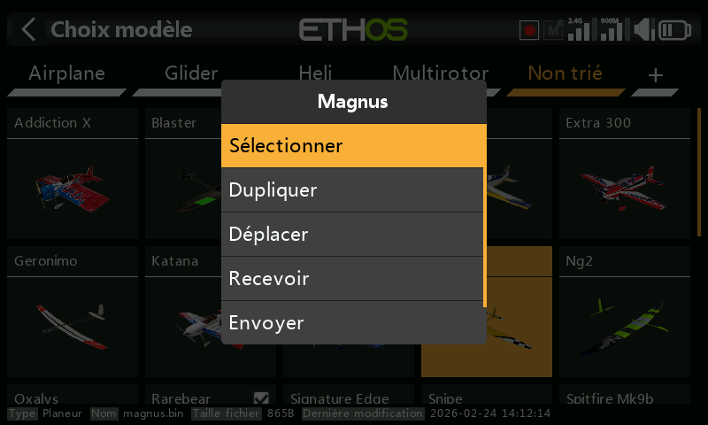

Appuyez sur **« Sélectionner »** pour faire du modèle sélectionné le modèle actif.

Sinon, vous pouvez utiliser la méthode de **« Sélection rapide »** décrite ci-dessus.

#### Dupliquer un modèle

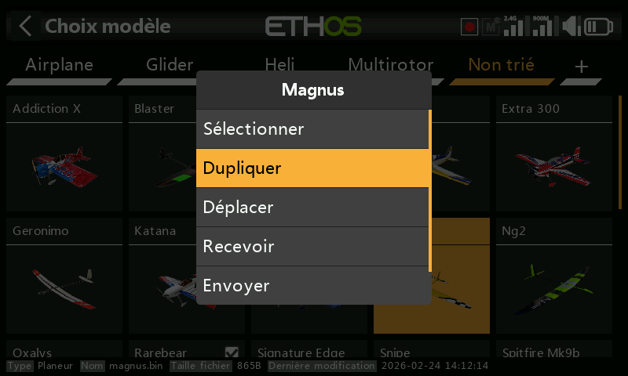

Appuyez sur **« Dupliquer »** pour créer une copie du modèle sélectionné.

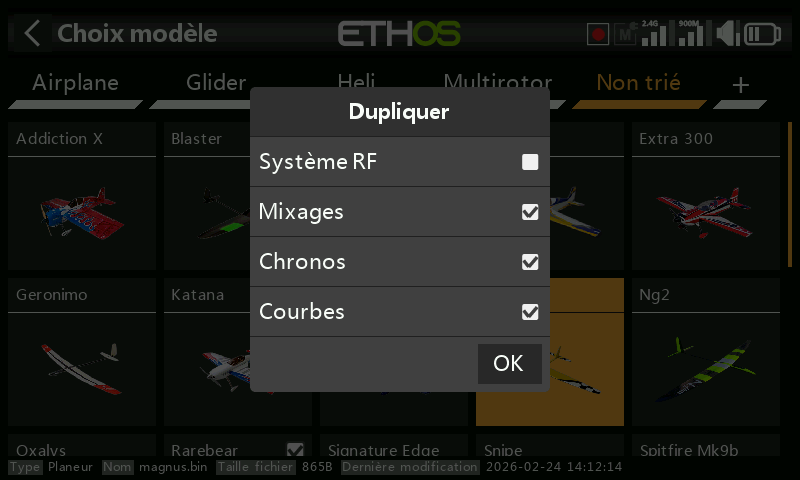

Une boîte de dialogue s’ouvrira pour vous permettre de **personnaliser la copie**.

Par défaut, le système RF n’est pas dupliqué, ce qui signifie que le **module RF sera désactivé** dans la copie, et le **numéro de modèle différent**.

Si l’option « Système RF » est sélectionnée, la configuration RF, y compris le numéro de modèle, sera copiée.

Les **mixages, timers et courbes** du modèle ne seront pas clonés si l'option correspondante n’est pas sélectionnée.

Appuyez sur **OK** pour continuer.

Un message **« Modèle copié avec succès ! »** s’affichera une fois l’opération terminée.

#### Déplacer un modèle

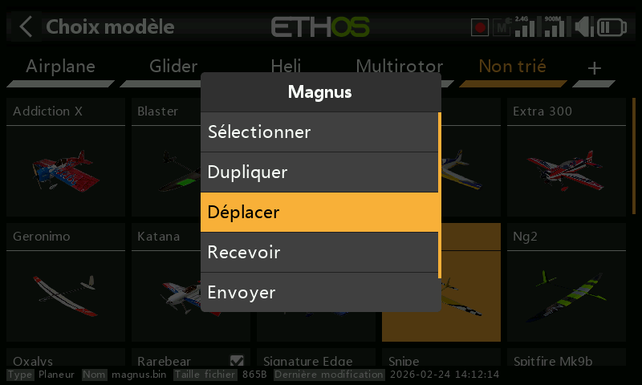

Pour **déplacer un modèle vers un autre dossier**, appuyez sur l’**icône du modèle**, puis sélectionnez **« Déplacer »** dans le menu contextuel.

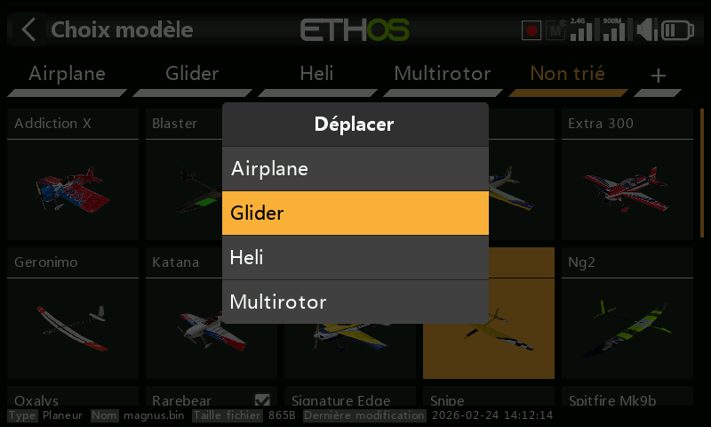

Choisissez alors le dossier vers lequel vous souhaitez le déplacer.

#### Recevoir un modèle

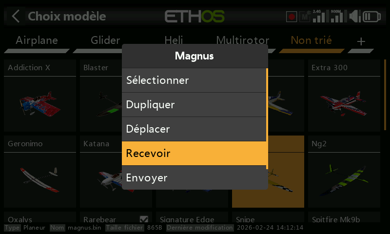

Appuyez sur **« Recevoir »** pour lancer le processus de réception d’un modèle depuis une autre radio Ethos via Bluetooth.
Veuillez noter que l’option « Recevoir un modèle » doit être activée avant d’utiliser « Envoyer un modèle » sur la radio émettrice.

Tant qu’aucune **connexion Bluetooth** n’est établie, une **boîte de dialogue « En attente »** est affichée.

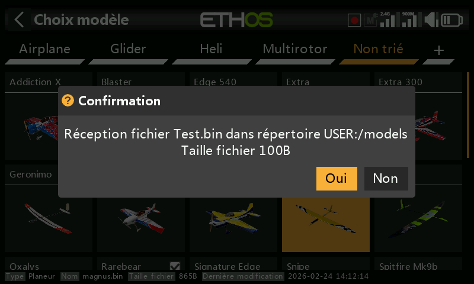

Une fois la **connexion établie**, une **boîte de dialogue « Confirmation »** s’affiche et attend une confirmation pour continuer.

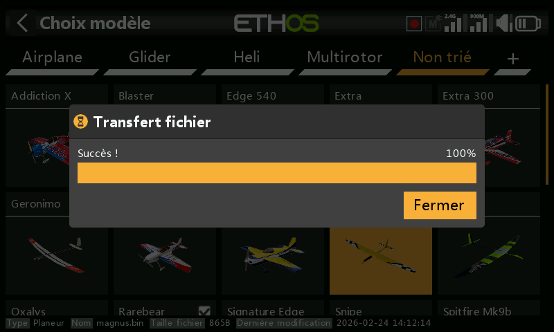

Le **transfert du fichier commence** et une **barre de progression** est affichée, suivie d’un message de succès une fois l’opération terminée.

#### Envoi de modèle

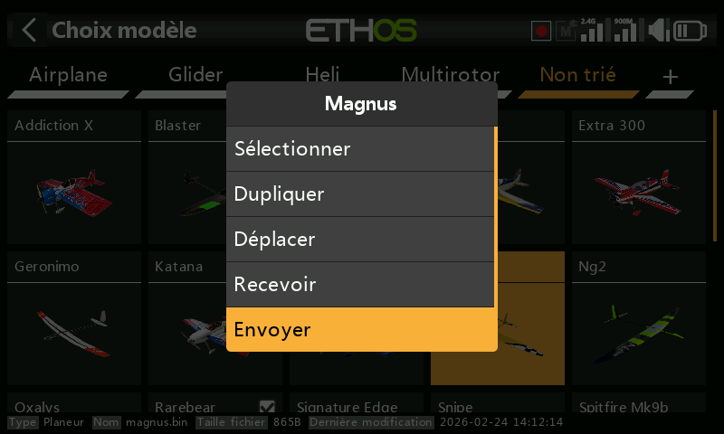

Appuyez sur **« Envoyer »** pour lancer le **transfert d’un modèle vers une autre radio Ethos via Bluetooth**.
Veuillez noter que l’option **« Recevoir »** doit être activée **avant** d’utiliser **« Envoyer »** sur la radio émettrice.

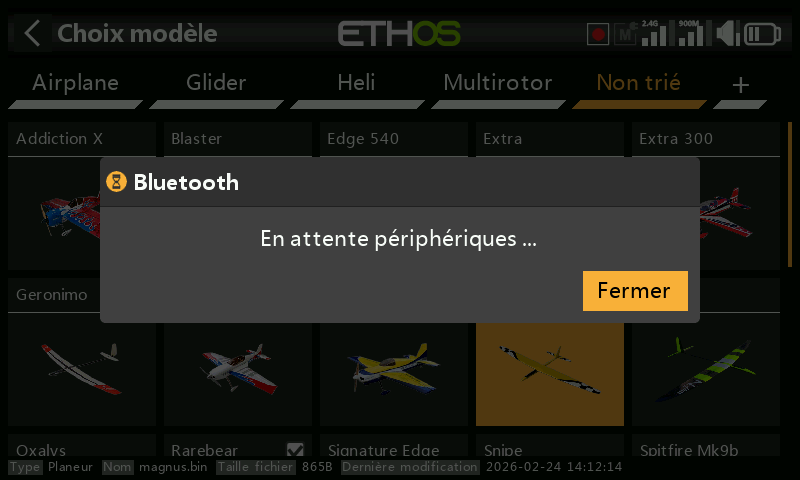

Tant qu’aucune connexion Bluetooth n’est établie, une boîte de dialogue **« En attente périphériques »** s’affiche.

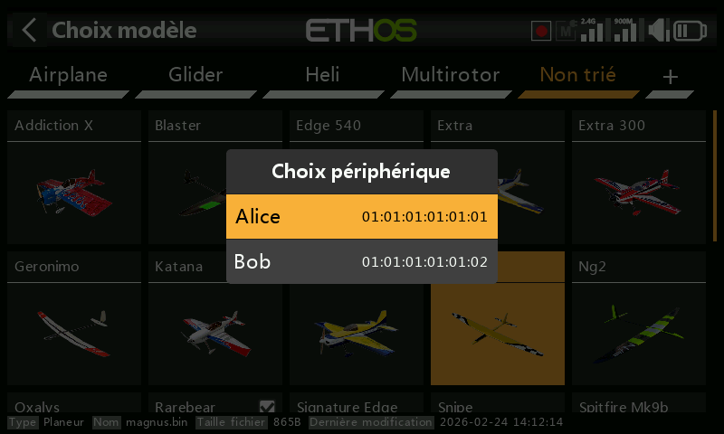

Une fois que des appareils ont été détectés, une boîte de dialogue de sélection d’appareil s’affiche. Sélectionnez alors l’appareil vers lequel le modèle doit être envoyé.

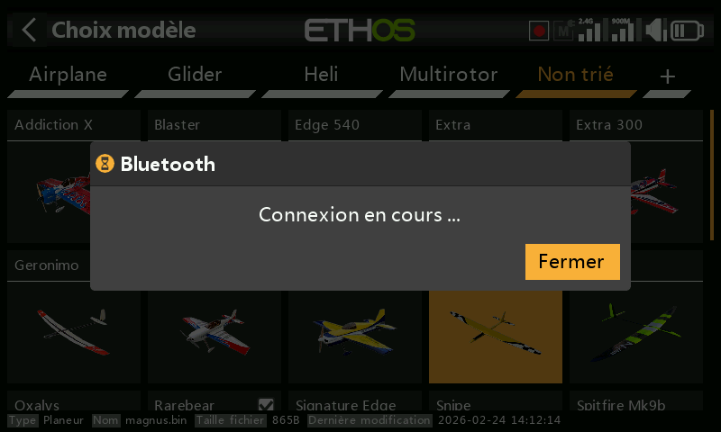

Le **transfert de fichier commence** et une **barre de progression** est affichée.

Un message apparaît une fois le transfert terminé.

#### Supprimer un modèle

Appuyez sur **« Supprimer »** pour effacer un modèle.
Cette option **n’est pas disponible pour le modèle actif**.
