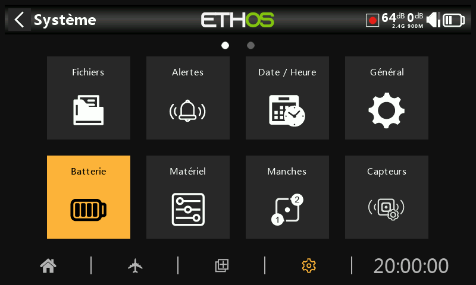
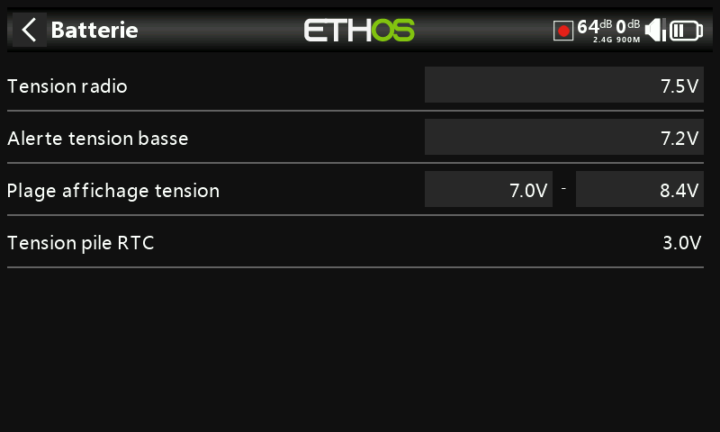

## Batterie

### Tension radio

La « Tension radio » affiche la tension actuelle de la batterie. Cette valeur peut-être étalonnée en cas d'écart constaté avec un multimètre. L'appui du le champ correspondant permet le réglage. La batterie LIPO 2S de la radio chargée sera de l'ordre de 8,4V.

### Alerte tension basse

Il s'agit de la tension de seuil d'alarme. La valeur par défaut est de 7,2 V. Une valeur de 7,4 V donnerait une marge de sécurité supplémentaire.

Une alerte vocale « Batterie radio faible » est émise lorsque la vérification de la « Tension radio » est activée dans Système / Alertes et que la tension de la radio est inférieure au seuil défini ici.

_**Avertissement!**_

Lorsque cette alerte est donnée, il est prudent d'atterrir et de charger la batterie de la radio !

NB:  lorsque la tension de la batterie de la radio atteint 6.0v, la radio s'éteint automatiquement pour protéger la batterie (2 x 3.0v) !

### Plage affichage tension

Ce règlage permet l'étalonnage de l'icône de batterie sur la barre supérieure. La plage d'utilisation de la batterie d'origine Frsky par défaut est de 7.0v à 8.4v. La valeur minimum peut être ajustée afin d'avoir l'alerte "Tension batterie faible" assez tôt pour éviter une décharge trop importante de la batterie de la radio.
En cas de changement de type de batterie, il est nécessaire d'adapter la plage d'affichage selon les caractéristiques de la batterie de remplacement.

### Tension pile RTC

Affiche la tension de la batterie RTC (Real Time Clock) interne de la radio. La tension est de 3,0 V pour une batterie neuve. Si la tension est inférieure à 2,7 V, veuillez remplacer la pile (CR2020) à l'intérieur de la radio pour assurer le fonctionnement de l'horloge temps réel. En dessous de 2.5v, une alerte "Batterie RTC faible" est émise.
