# Alerte de capacité de batterie

Cette alerte est basée sur la **capacité consommée** (mAh) plutôt que sur la tension. Il s'agit d'une mesure plus directe de la part de la batterie réellement utilisée. Deux méthodes sont possibles, selon le matériel installé.

## Option A : un ESC de la série Neuron

Les ESC Neuron de FrSky transmettent directement la consommation. Aucun capteur calculé n'est nécessaire. Dans [Options du récepteur → Port de télémétrie](../system-setup/devices.md), réglez le port de télémétrie sur S.Port, connectez le câble de télémétrie du Neuron, puis [découvrez les capteurs](../model-setup/telemetry.md#discovering-sensors). Le capteur d'intérêt est **ESC Consumption**.

1. Ajoutez un [inter logique](../model-setup/logical-switches.md) pour surveiller `ESC Consumption`, qui devient Vrai au-dessus d'un seuil, par exemple 900 mAh — soit environ 60 % d'une batterie dimensionnée pour atterrir avec encore ~30 % de réserve.
2. Ajoutez une [fonction spéciale Play audio](../model-setup/special-functions.md), avec le nouvel inter logique comme condition d'activation, et une étape **Play value** pour `ESC Consumption`.

Comme mesure de sécurité supplémentaire, les ESC Neuron transmettent également **ESC Voltage**. Configurez un second inter logique de la même manière que dans [Alerte de tension de batterie basse](low-battery-warning.md) avec un seuil inférieur à 3,4 V par cellule pendant 4 secondes, soit 13,6 V pour une batterie LiPo 4S. Associez-lui sa propre fonction Play audio, répétée toutes les 5 secondes.

## Option B : un capteur de courant + un capteur calculé

Si l'ESC ne transmet pas la consommation, un capteur de courant (par exemple de la série FrSky FASxxx) associé à un [capteur de consommation calculé **Consumption**](../model-setup/telemetry.md#calculated-sensors) remplit la même fonction.

### 1. Connecter et découvrir

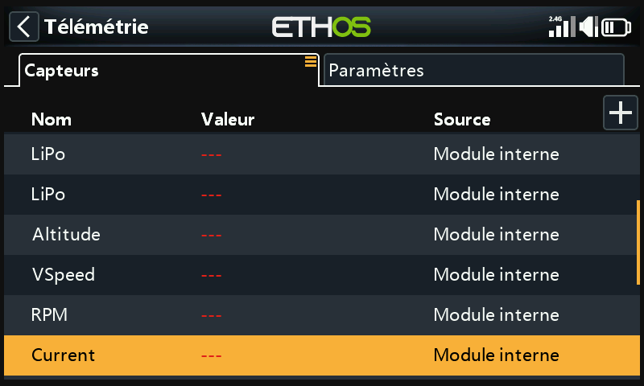

Connectez le câble S.Port du capteur de courant et lancez la découverte. Il apparaît sous le nom **Current**. Réglez sa **Plage** en fonction du capteur (par exemple 0–100 A pour un FAS100).

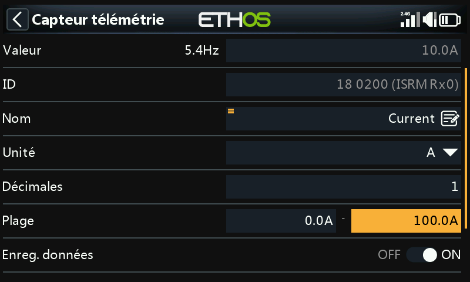

### 2. Créer le capteur calculé Consumption

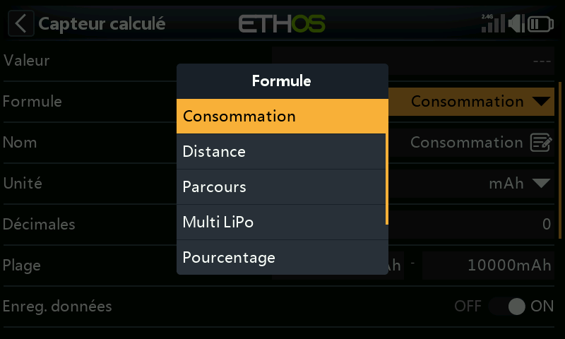

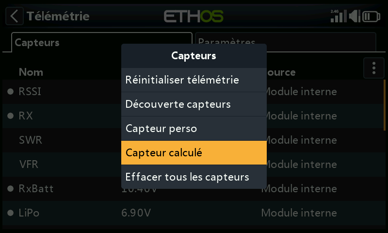

Dans Télémétrie, cliquez sur **Créer un capteur calculé** → **Consumption**. Réglez les unités sur `mAh` et la **Plage** en fonction de la capacité de la batterie (par exemple 2800 mAh) et la **Source** sur `Current`.

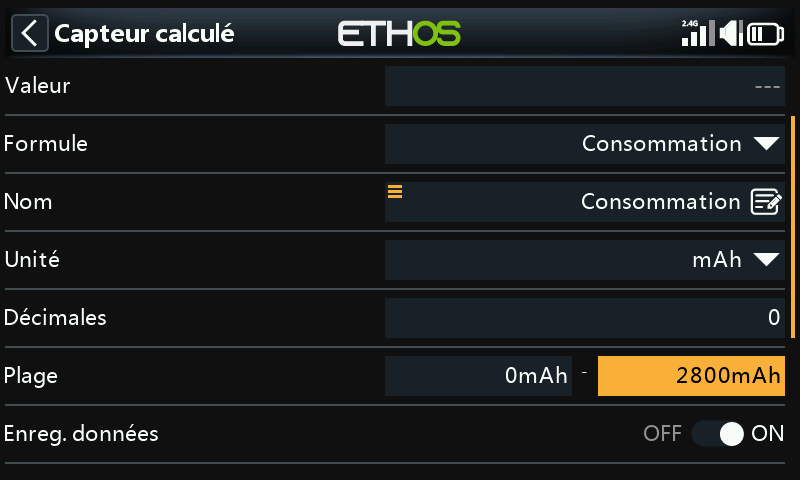

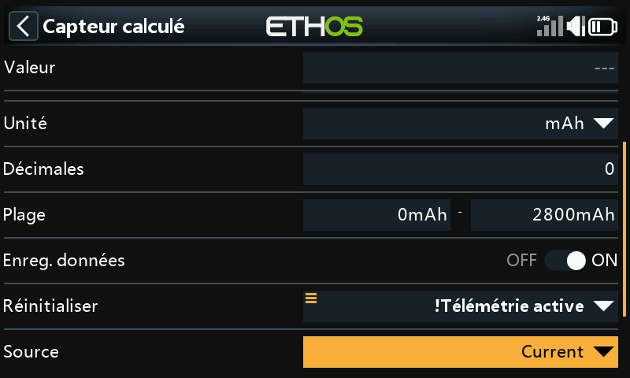

Réglez **Reset** sur l'événement système `!Telemetry Active`. Sélectionnez d'abord **Telemetry Active**, puis appuyez longuement sur `ENT` et choisissez **Inverser**. Ainsi, le total cumulé est réinitialisé automatiquement dès que la télémétrie est perdue (c'est-à-dire lorsque le modèle est éteint).

### 3. Annonces par palier

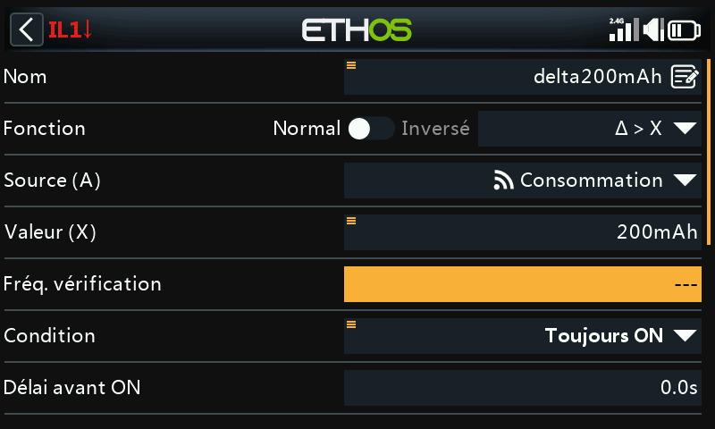

Ajoutez un inter logique utilisant la fonction Delta **Δ > X** pour surveiller `Consumption`, qui se déclenche chaque fois que la valeur augmente d'un pas fixe, par exemple tous les 200 mAh. Ce pas convient bien à une batterie de 2800 mAh.

!!! tip
    Réglez l'**Intervalle de vérification** sur `---` (Infini) afin que la fonction continue à cumuler jusqu'au seuil suivant, au lieu d'être réinitialisée après une période définie. Pendant le débogage, attribuez à la **Durée minimale** une petite valeur supérieure à 0. Avec une valeur de 0,0, le déclenchement est trop bref pour être visible à l'écran.

Ajoutez une fonction spéciale Play audio, avec cet inter logique comme condition d'activation, et une étape Play value pour `Consumption` :

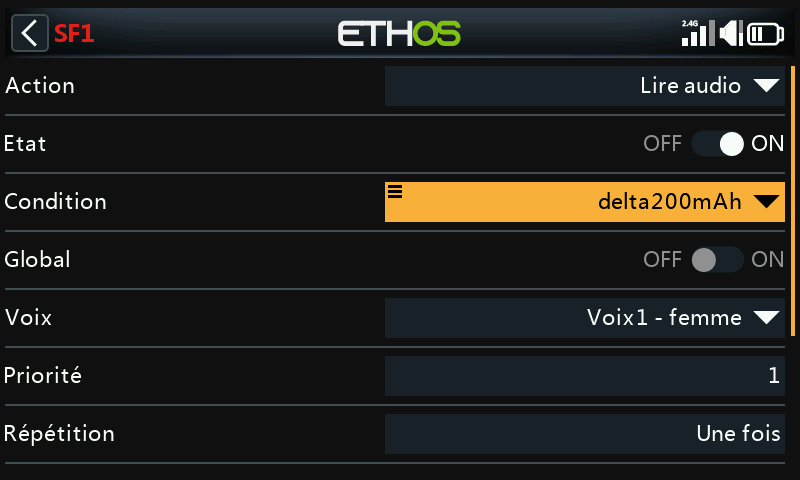

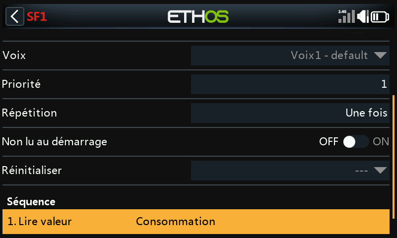

### 4. Alerte de capacité basse

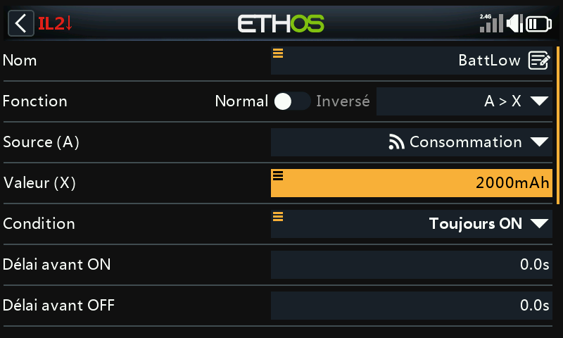

Un second inter logique se déclenche une seule fois lorsque la capacité consommée dépasse un seuil défini, par exemple 2000 mAh pour une batterie de 2800 mAh. Associez-le à une fonction Play audio répétée toutes les 10 secondes jusqu'à la réinitialisation du modèle :

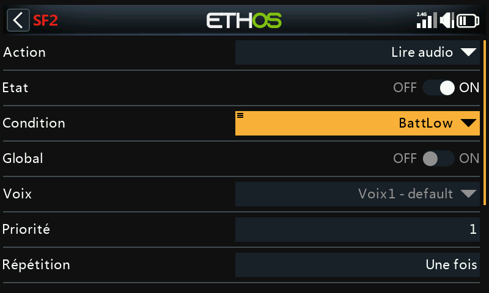

