# Mixage Butterfly (Corbeau)

Le freinage butterfly (ou crocodile) permet de contrôler le taux de
descente, le plus souvent sur les planeurs. Les ailerons se relèvent
modérément tandis que les volets s'abaissent beaucoup, ce qui crée une
traînée importante. Ce dispositif est particulièrement utile pour contrôler l'approche à l'atterrissage. Pour cet exemple, on supposera qu'il s'agit d'un planeur
dont les voies Flap existent déjà (créées par l'assistant [Choix du
modèle](../model-setup/model-select.md)), et que le manche des gaz sert
d'entrée de frein. Le butterfly est nul lorsque le manche des gaz est en position haute, puis augmente progressivement à mesure que le manche est abaissé. Une compensation à la profondeur est également appliquée afin d'éviter que le planeur ne remonte lorsque le freinage crocodile est activé.

## 1. Désactiver le mixage Volets par défaut

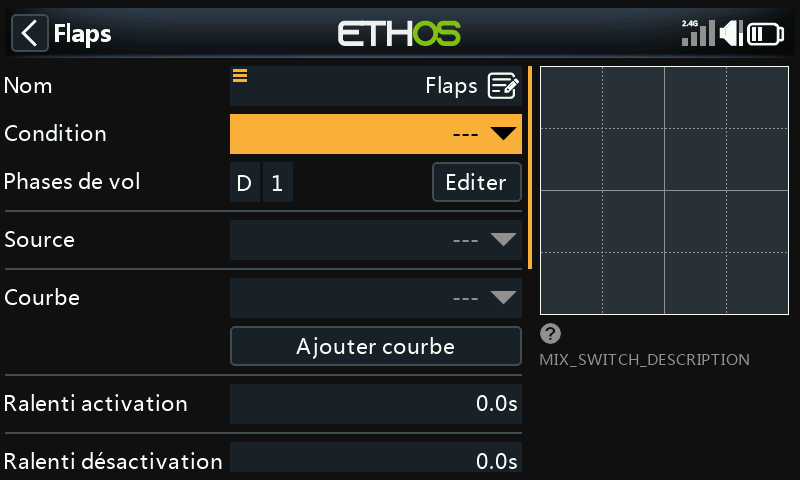

Réglez la **Condition active** du mixage Flaps créé par l'assistant sur
`---`. Le mixage ne sera alors pas utilisé.

## 2. Créer le mixage Butterfly

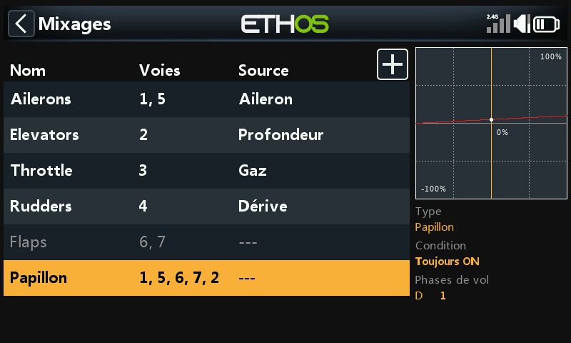

Appuyez sur n'importe quelle ligne de mixage, **Ajouter un mix** →
**Butterfly** dans la [bibliothèque de
mixages](../model-setup/mixes.md#mix-libraries), puis placez-le après le
mixage Flaps (désormais désactivé).

## 3. Configurer l'entrée

Réglez **Entrée** sur **Gaz**. Par défaut, l'entrée des gaz est au
maximum lorsque le manche est complètement levé, alors que le butterfly
doit être à 0 dans cette position. Appuyez longuement sur `ENT` sur Gaz
et sélectionnez **Inverser** :

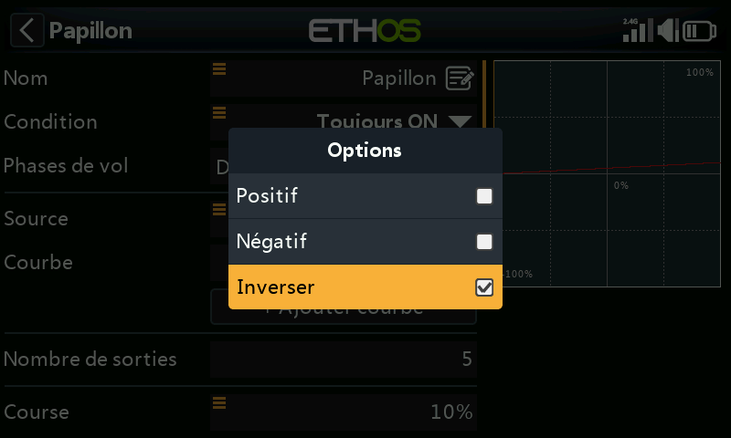

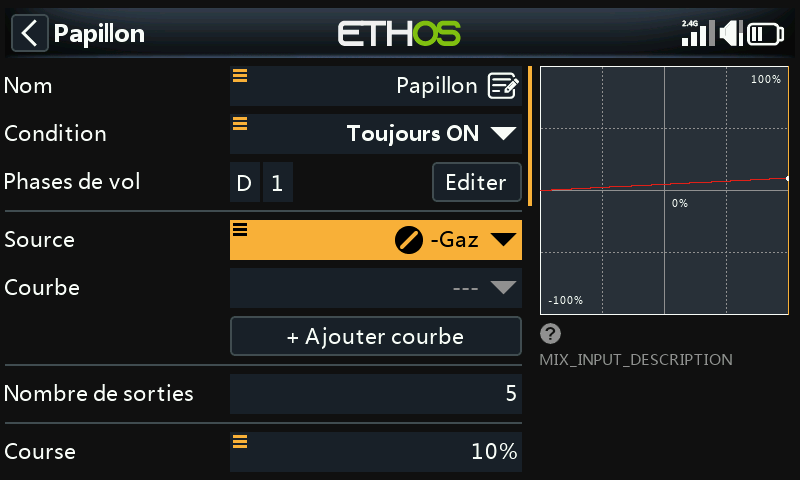

Avec le manche des gaz complètement relevé, l'entrée est maintenant à 0,
et le champ affiche `-Gaz` pour indiquer qu'elle a été inversée. Si vous
ne souhaitez pas que le butterfly soit disponible en permanence, réglez
la **Condition active** sur un mode de vol tel qu'un mode
d'atterrissage (ou sur une autre commande).

## 4. Ajouter une courbe de zone morte

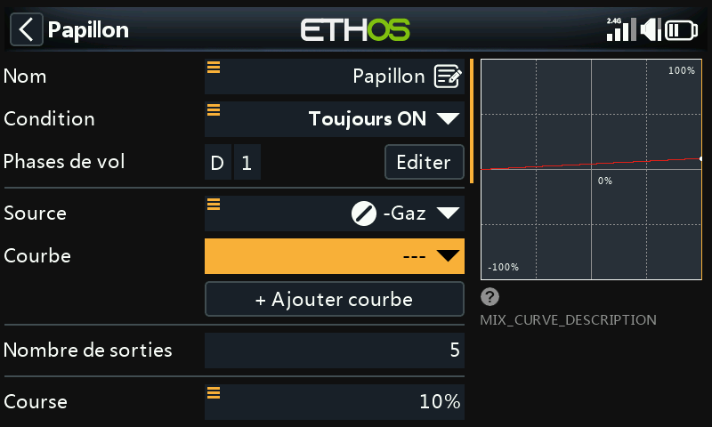

Une petite bande morte à l'extrémité zéro du manche évite un déploiement
accidentel si le manche bouge un peu près de la butée. Ajoutez une
courbe personnalisée à 3 points (nommée par exemple « Zone morte ») avec le
**Mode facile** désactivé, afin de pouvoir décaler les points X :

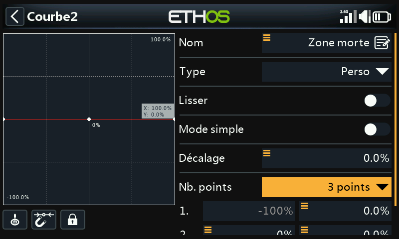

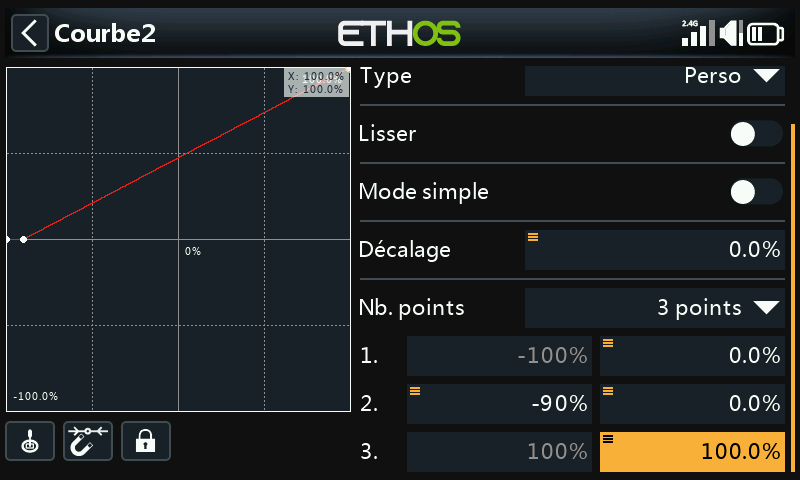

!!! note
    Dès que vous ajoutez votre propre courbe au mixage Butterfly, le
    décalage interne 0–100 (normalement appliqué automatiquement) est
    supprimé. La courbe doit donc reproduire elle-même cette
    transformation 0–100. Dans cet exemple, la sortie reste à 0 %
    jusqu'à ce que le manche des gaz atteigne −90 %, puis augmente
    linéairement jusqu'à 100 % :

    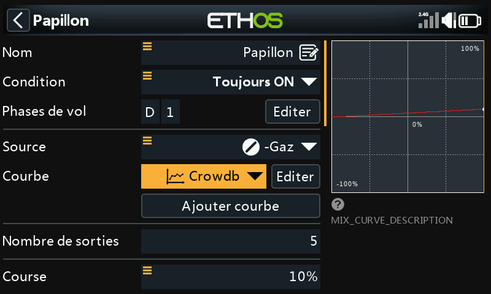

## 5. Configurer les ailerons et les volets

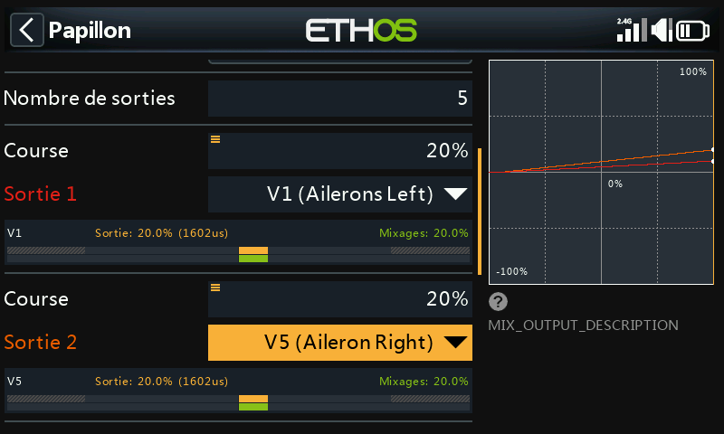

Normalement, les ailerons sont réglés pour se relever modérément, par exemple de 20 %, tandis que les volets s'abaissent beaucoup davantage. C'est la répartition habituellement utilisée.
Les volets présentent une particularité : ils nécessitent une très grande course vers le bas, avec très peu de débattement vers le haut. Ce résultat est généralement obtenu en décalant les guignols des servos de volets de 20 à 30° par rapport au neutre mécanique. Ainsi, lorsque le servo est au neutre, les volets se trouvent déjà approximativement à mi-course vers le bas.

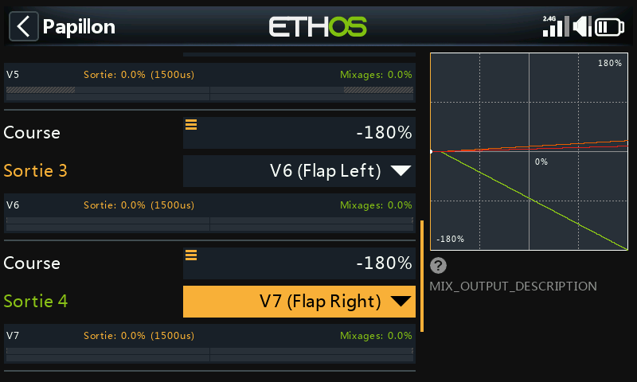

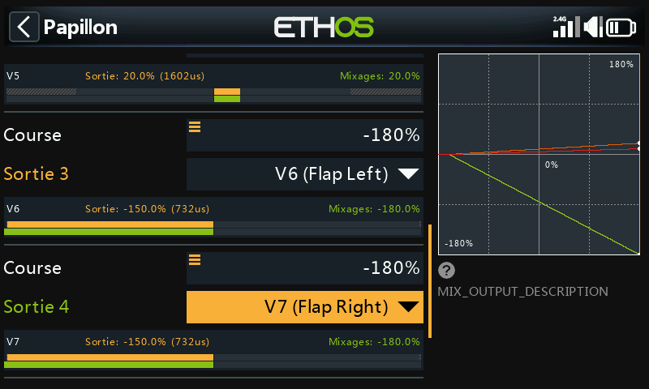

Réglez le Débattement du mixage des volets à une valeur élevée (par
exemple −180 %) pour un débattement maximal. La course physique réelle
est déterminée par les valeurs Min/Max des
[Sorties](../model-setup/outputs.md).

!!! tip
    Pour éviter de surcharger les servos, réglez d'abord les limites
    Min/Max des Sorties à des valeurs prudentes (par exemple ±30 %),
    puis augmentez-les avec précaution lors de la configuration finale,
    en faisant attention aux points de blocage.

## 6. Ajouter un mixage de décalage « Flaps Neutral »

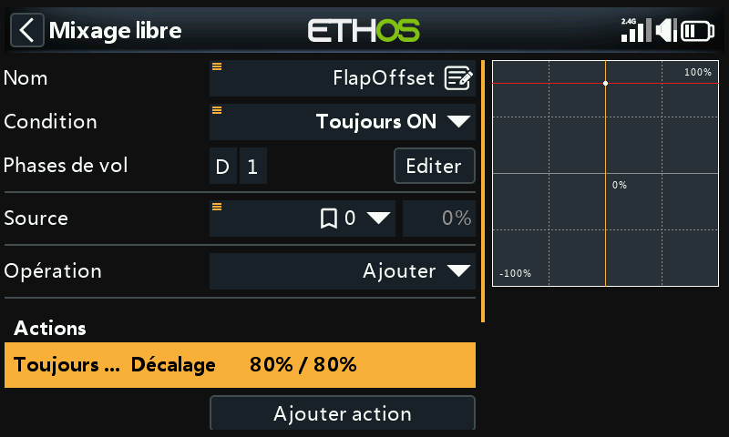

Comme le décalage des guignols laisse les volets déviés vers le bas
d'environ 20 à 30 % au point mort du servo, un **Mixage Décalé** est
nécessaire pour ramener les volets à la véritable position neutre de
l'aile pour un vol normal. Commencez avec un décalage de 80 % (à
ajuster), avec 2 voies de sortie affectées à vos deux voies de volets :

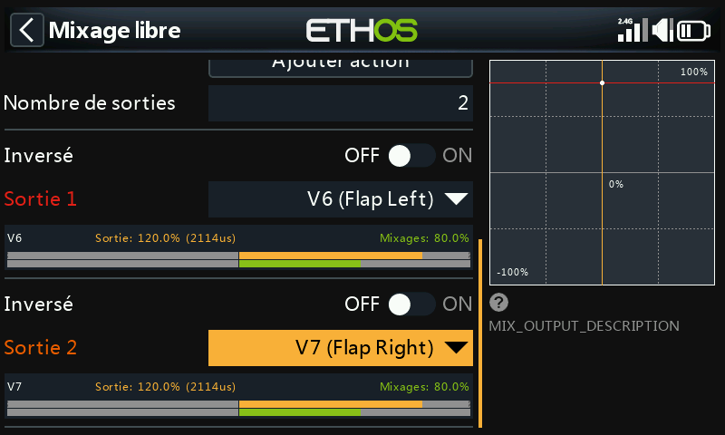

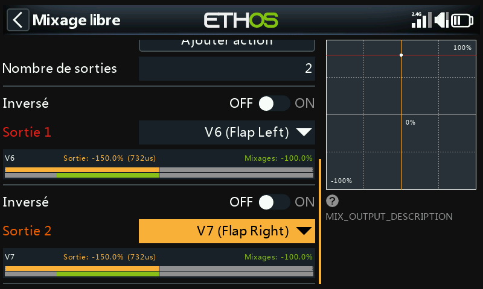

Avec le manche des gaz à fond vers le haut (mixage Butterfly désactivé),
vérifiez que les valeurs de la table de mixage des volets se situent au
niveau du décalage (80 %). En abaissant complètement le manche des gaz,
la sortie du mixage doit se déplacer de la
totalité du Débattement (par exemple de 80 % à −100 %, soit une
amplitude de 180 %). Les limites réelles de course se configurent dans
les Sorties, à l'aide des paramètres Min et Max ou d'une courbe.

## 7. Ajouter la courbe et le mixage de compensation de profondeur {: #7-add-the-elevator-compensation-curve-and-mix }

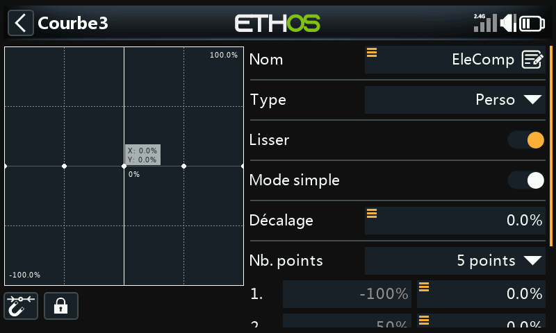

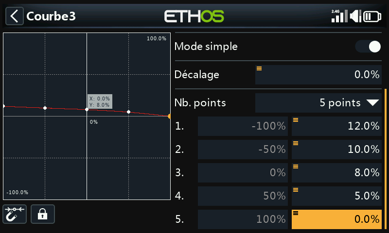

Comme la compensation nécessaire n'est pas linéaire, utilisez une courbe
plutôt qu'un Débattement fixe. Définissez une courbe personnalisée à
5 points (par exemple « Correct. Prof. »). Dans cet exemple, ses points ont
les valeurs initiales 12 %/10 %/8 %/5 %/0 %. Si votre aéronef n'a pas
de courbe de compensation de profondeur spécifiée, ces points devront
être déterminés empiriquement.

Ensuite, convertissez cette courbe en une valeur utilisable comme
**Débattement** de mixage : ajoutez un [Mixage
Libre](../model-setup/mixes.md#mix-libraries) (« EleCompx ») avec les gaz
comme source et la courbe « Correct. Prof. » associée, avec une sortie sur une voie
de numéro élevé non utilisée (par exemple CH20).

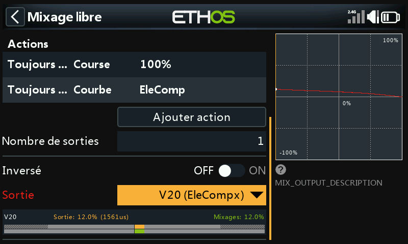

Revenez maintenant au mixage Butterfly, appuyez longuement sur `ENT` sur
le **Débattement** de la sortie de profondeur, sélectionnez **Utiliser
une source**, puis choisissez CH20 (EleCompx) dans la catégorie Voies.

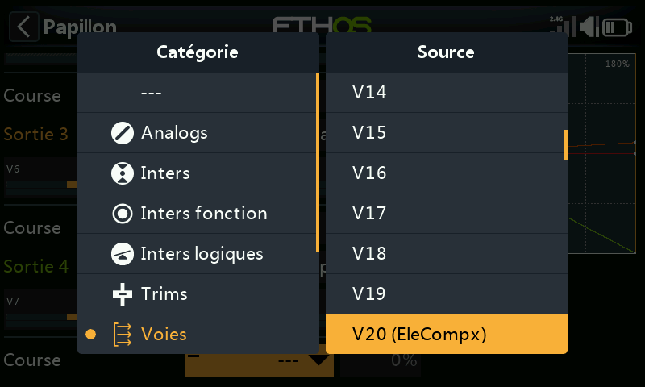

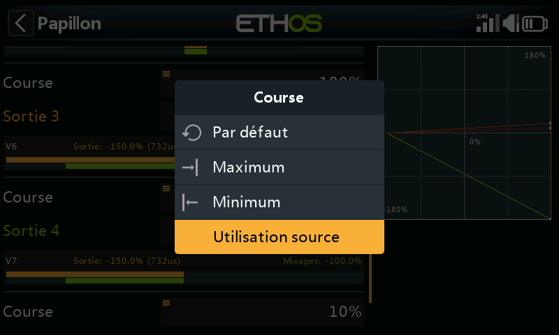

Le mixage Butterfly est maintenant entièrement configuré :

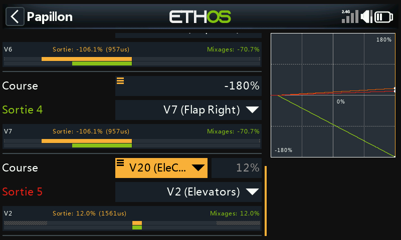

## 8. Vérifier avec l'affichage par voie

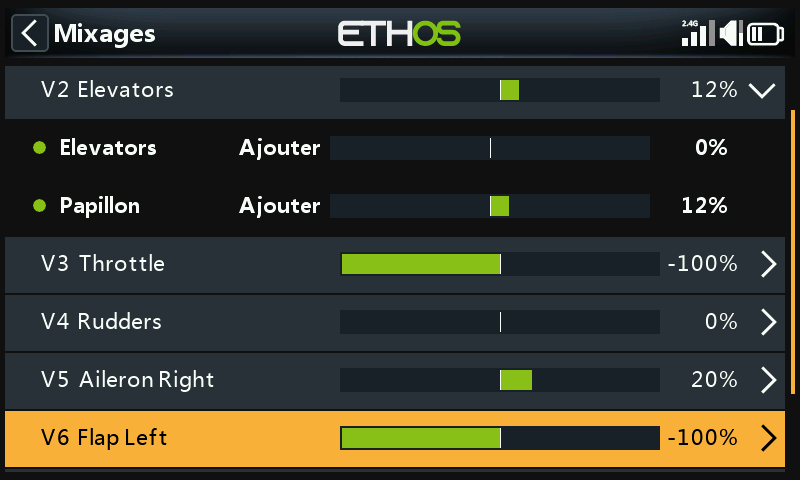

Le passage à l'[affichage par
voie](../model-setup/mixes.md#per-channel-view) sur la profondeur vous
permet de voir la mise à jour simultanée de tous les mixages
contributeurs (entrée manche + compensation Butterfly) lorsque le manche
des gaz/frein se déplace. Cette vue est beaucoup plus pratique pour le
débogage que la vue en tableau.

!!! tip
    Il est utile de disposer de données sur la course de profondeur
    nécessaire en fonction du débattement des volets (fournies par le
    fabricant de la cellule ou issues de sources communautaires) avant
    de définir les valeurs de départ de la courbe de compensation. À
    défaut, commencez par quelques millimètres de course de profondeur
    pour un déploiement complet des volets, puis affinez à partir de là.
