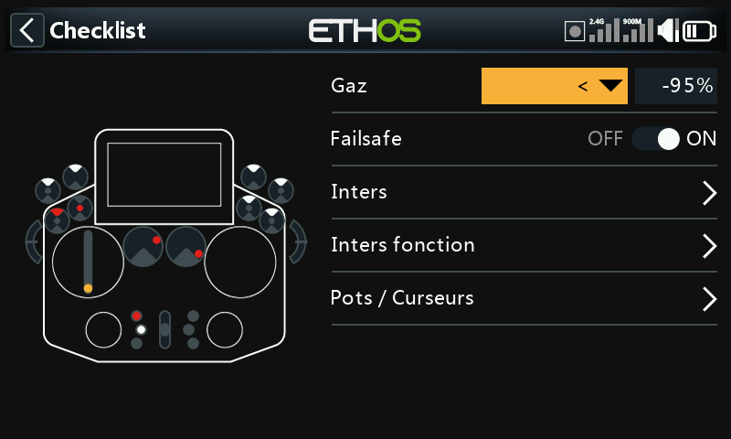
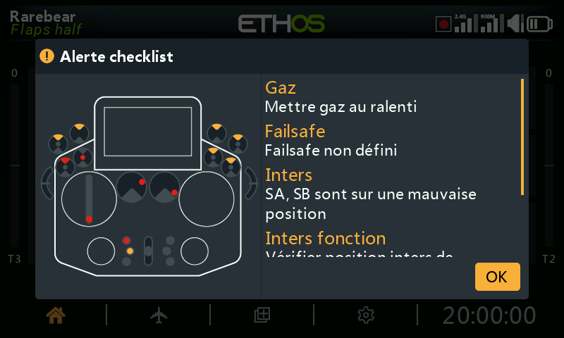
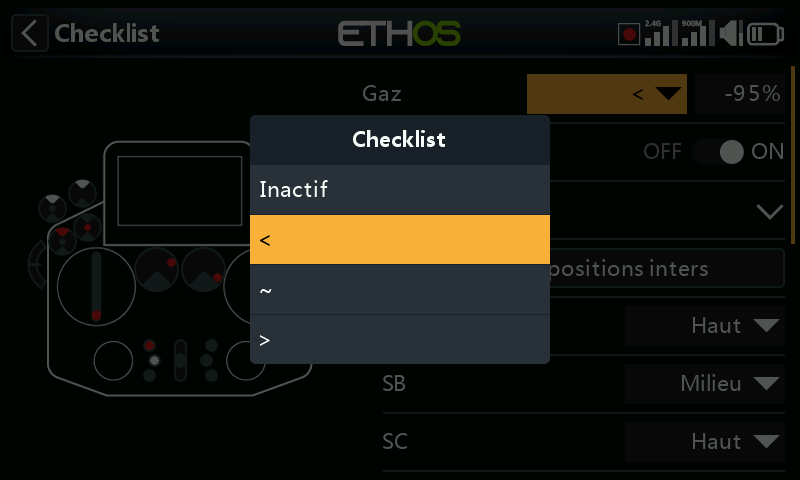
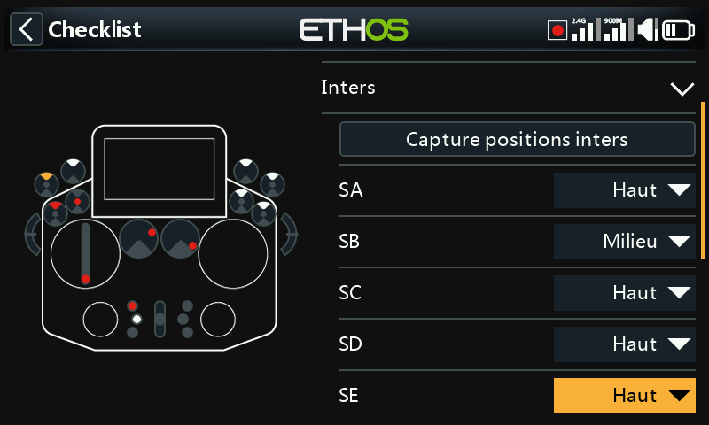
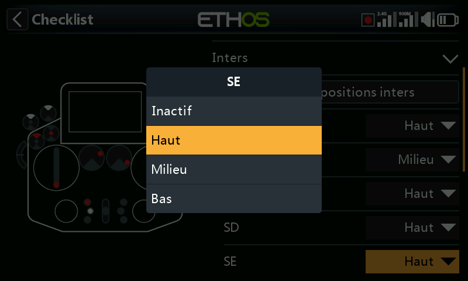
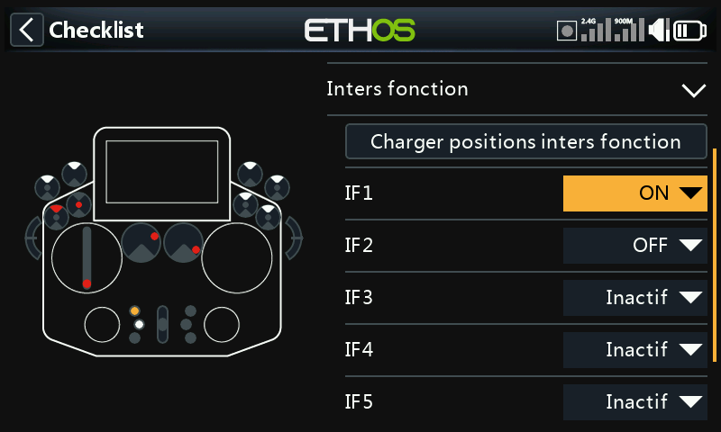
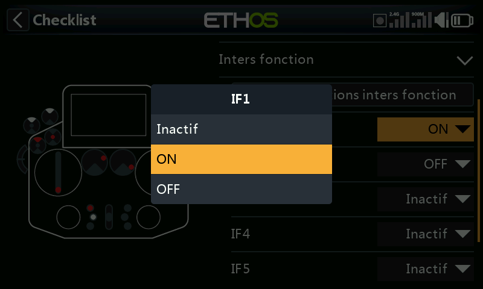
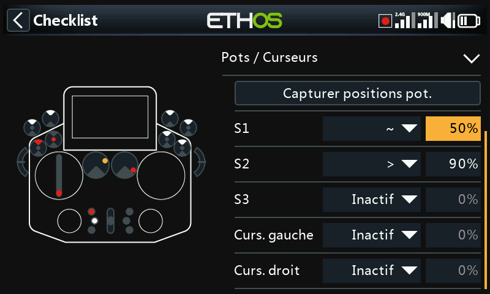
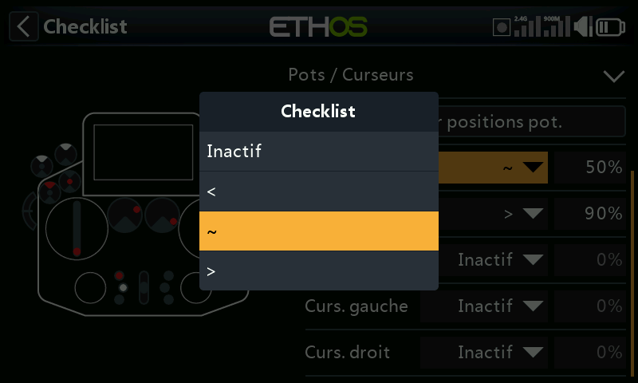
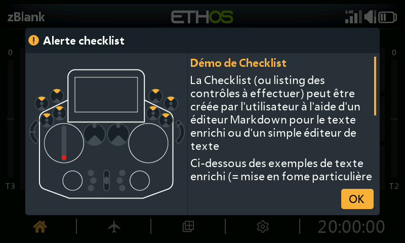

# Liste de vérification

Un ensemble de contrôles de sécurité avant vol qui s'exécutent à la mise
sous tension de la radio et/ou au chargement d'un modèle. Les contrôles
intégrés comprennent le mode silencieux, le failsafe non défini, les
positions des interrupteurs/potentiomètres, la batterie de la radio et la
pile RTC : le contrôle des interrupteurs indique dans quel sens chaque
interrupteur doit être déplacé, au moyen de points rouges sur l'écran
d'avertissement :

!!! note
    `OK` comme `RTN` ignore entièrement les contrôles avant vol, quoi que
    suggère l'avertissement affiché à l'écran.

## Contrôle des gaz

Activez le contrôle et choisissez un opérateur : `<` (inférieur à), `~`
(approximativement égal) ou `>` (supérieur à) : appliqué à une valeur. Un
avertissement est émis si le manche des gaz se trouve hors de la plage
autorisée par cette comparaison.

## Contrôle du failsafe

Avertit si le [failsafe](rf-system.md#failsafe) n'a pas été défini pour le
modèle courant.

!!! tip
    Il est fortement recommandé de laisser cette option activée.

## Contrôle des interrupteurs

Pour chaque interrupteur, exigez une position précise au démarrage (les
interrupteurs portant un nom personnalisé défini dans [Configuration du
système →
Matériel](../system-setup/hardware.md#switches-settings) apparaissent avec
ces noms). **Charger toutes les positions des interrupteurs** enregistre
les positions physiques *actuelles* comme positions attendues pour chaque
interrupteur non réglé sur **Aucune vérification**.

## Contrôle des interrupteurs de fonction

Le même principe, appliqué aux six [interrupteurs de
fonction](model-edit.md#function-switches). **Charger toutes les positions
des interrupteurs de fonction** fonctionne de la même manière que
ci-dessus.

## Contrôle des potentiomètres / curseurs

Exige des positions précises des potentiomètres/curseurs au démarrage,
individuellement pour chaque commande (`~`/`<`/`>`, comme pour le contrôle
des gaz). **Charger toutes les positions des potentiomètres** enregistre
automatiquement les positions actuelles. Vérifiez ensuite attentivement
les opérateurs sélectionnés automatiquement, car `~` par rapport à
`<`/`>` peut ne pas correspondre à votre intention réelle.

## Texte défini par l'utilisateur

Affiche un fichier en texte simple ou enrichi dans le cadre de la liste de
vérification au démarrage, une fois installé pour le modèle. Voir [Guide
pratique : liste de vérification en texte défini par
l'utilisateur](../how-to/user-defined-checklist.md) pour la procédure
complète.
