# Courbes

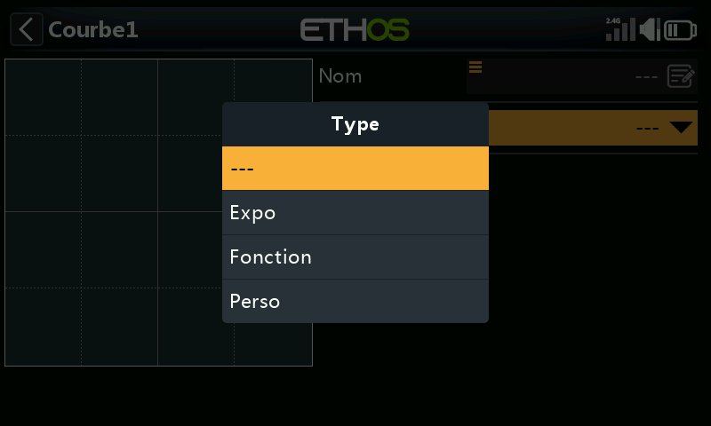

Courbes de réponse réutilisables pour les [Mixages](mixes.md#anatomy-of-a-mix) ou
les [Sorties](outputs.md#editing-a-channel) : l'Expo intégré est disponible
directement dans les deux, mais tout ce qui est plus élaboré se définit ici (ou via
**Ajouter courbe**, accessible directement depuis l'un ou l'autre écran d'édition).
Jusqu'à 50 courbes sont disponibles. Aucune n'existe par défaut (l'Expo reste de
toute façon toujours intégré). Ajoutez-en une avec **+**. Touchez une courbe
existante pour **Modifier**/**Déplacer**/**Copier-coller**/**Cloner**/**Supprimer**.

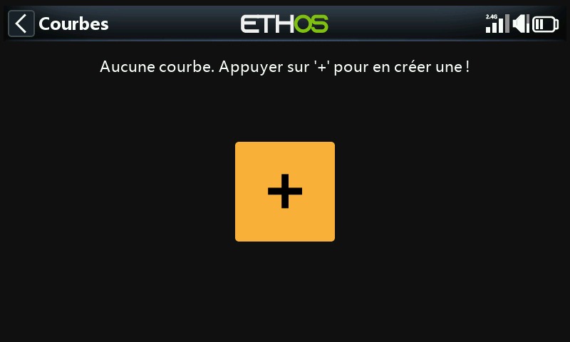

## Types de courbes

- **Expo** : valeur par défaut 40. Une valeur positive adoucit la réponse autour
  du neutre, une valeur négative l'accentue. L'adoucissement autour du milieu du
  manche aide à éviter de surpiloter, en particulier pour les pilotes les moins
  expérimentés.

  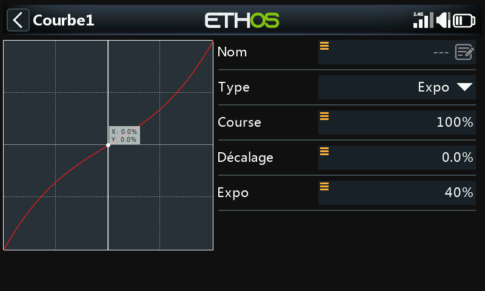

- **Fonction** : un petit ensemble de formes mathématiques fixes :

  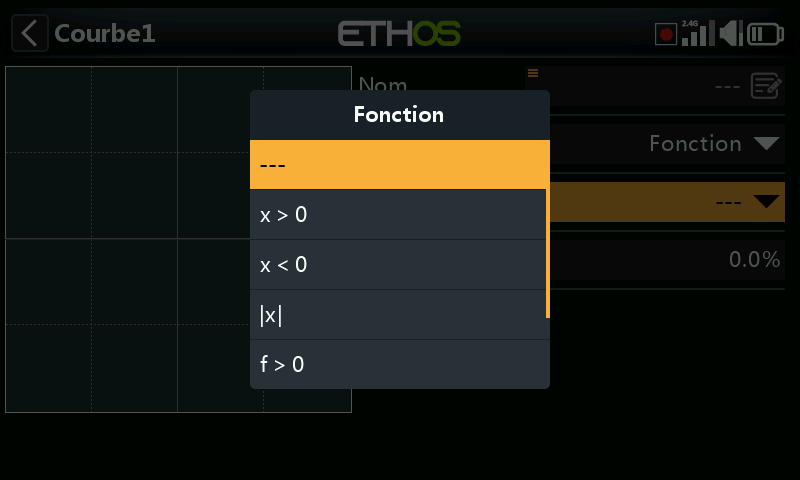

  - **x > 0** : transmet la source inchangée lorsqu'elle est positive.
    Sort 0 lorsqu'elle est négative.

    

  - **x < 0** : l'inverse : transmet la source lorsqu'elle est négative, 0
    lorsqu'elle est positive.

    

  - **|x|** : transmet la source sous forme de valeur absolue (toujours
    positive).

    

  - **f > 0** : sort 100 % lorsque la source est positive, 0 lorsqu'elle est
    négative (un interrupteur franc, pas une transmission directe).

    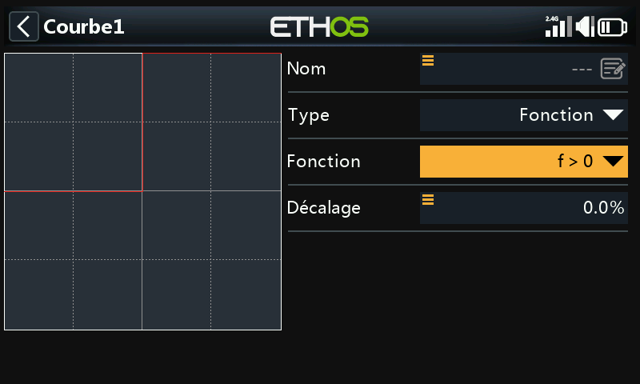

  - **f < 0** : sort −100 % lorsque la source est négative, 0 lorsqu'elle est
    positive.

    

  - **|f|** : sort −100 % lorsque la source est négative, +100 % lorsqu'elle est
    positive.

    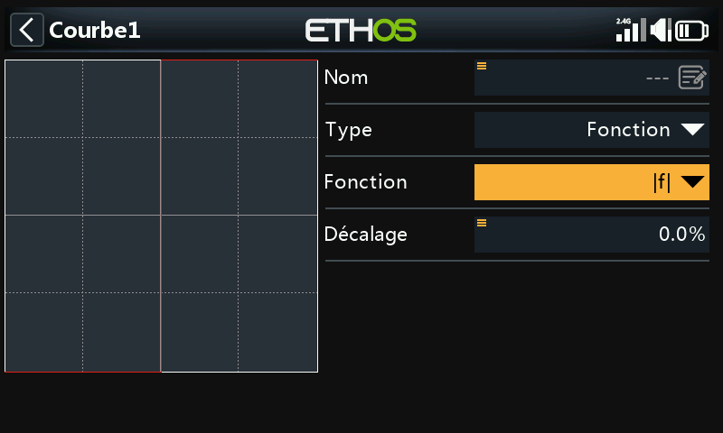

  Tous les types de courbes, y compris Fonction, disposent également d'un
  **Décalage**, qui les déplace vers le haut ou vers le bas sur l'axe Y (précision
  à une décimale, comme pour les valeurs Y en général) :

  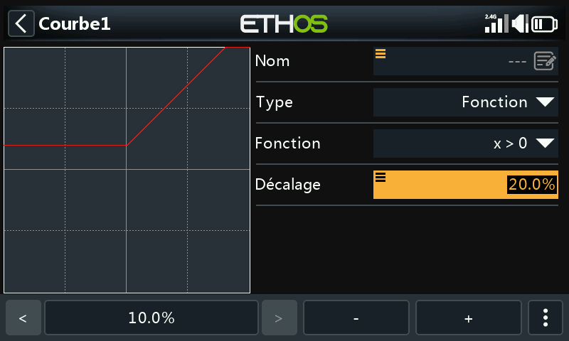

- **Personnalisée** : une courbe définie par points, 5 points par défaut, jusqu'à 21.

  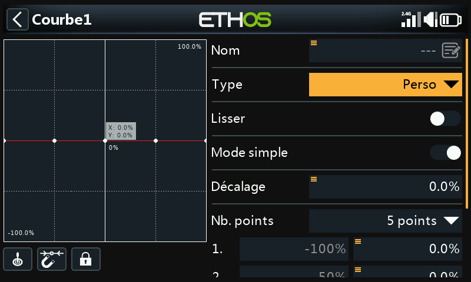

  - **Lissage** : fait passer une courbe lisse par tous les points au lieu de
    segments droits entre eux.

    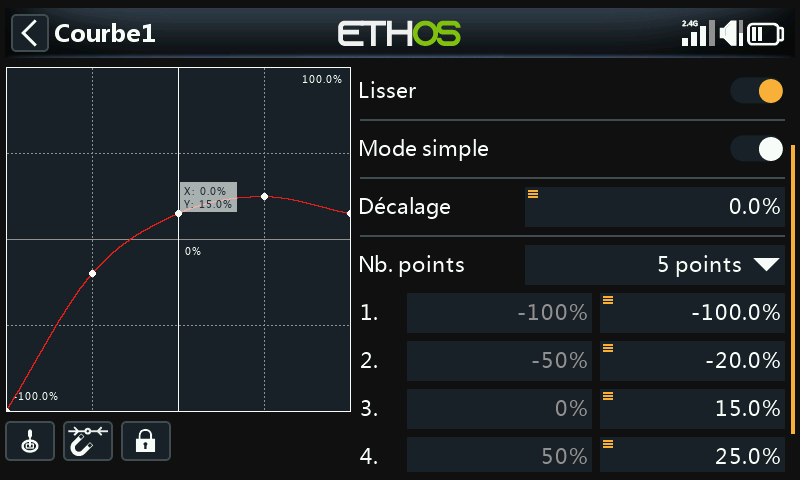

  - **Mode simple** : **Activé** limite l'édition aux seules coordonnées Y
    régulièrement espacées (X est fixe). **Désactivé** permet de modifier X et Y
    pour chaque point, à l'exception des extrémités −100 %/+100 %, qui sont
    verrouillées puisque la courbe doit toujours couvrir toute la plage du signal.

    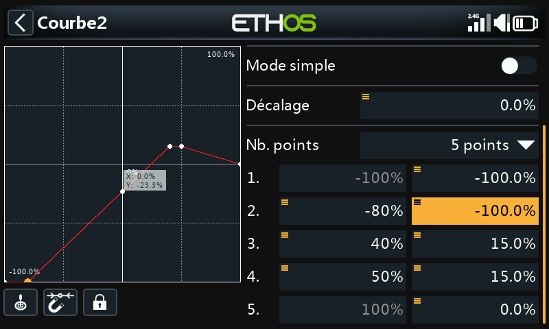

  **Commandes de l'éditeur** (même principe que l'[éditeur de courbe d'équilibrage
  des Sorties](outputs.md#balance-channels)) :

  - **Source** : par défaut, la ou les sources de mixage propres à la courbe, ou
    **Entrée analogique automatique** pour détecter le premier manche/curseur/
    potentiomètre déplacé.
  - Accrochage au point le plus proche avec l'encodeur rotatif, et un basculement
    **Verrou** pour figer les entrées pendant l'observation du mouvement de la
    gouverne obtenu.
  - Un curseur en temps réel indique la valeur d'entrée courante qui pilote la
    courbe, afin de faciliter son alignement sur un point avant l'ajustement.

## Piloter une courbe depuis une Var

Le **Décalage** d'une courbe Fonction comme un point individuel d'une courbe
**Personnalisée** peuvent être pilotés par une [Var](variables.md) au lieu d'une
valeur fixe. Cette Var peut à son tour être ajustée en vol grâce à un trim
réaffecté :

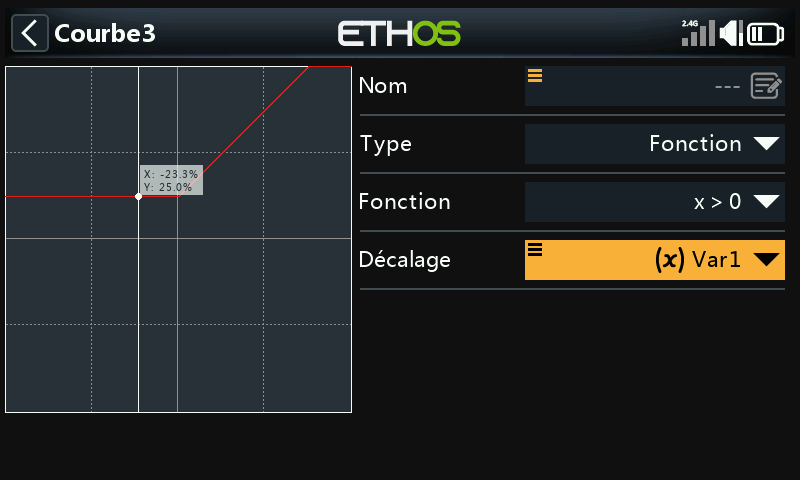

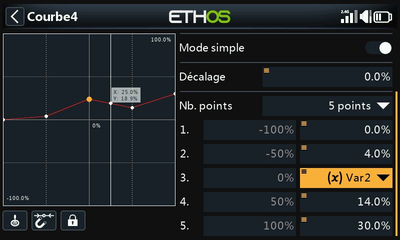

Voir [Variables](variables.md) et [Guide pratique : courbe de compensation
ajustable en vol](../how-to/in-flight-compensation-curve.md) pour un exemple
complet et détaillé de ce principe.
